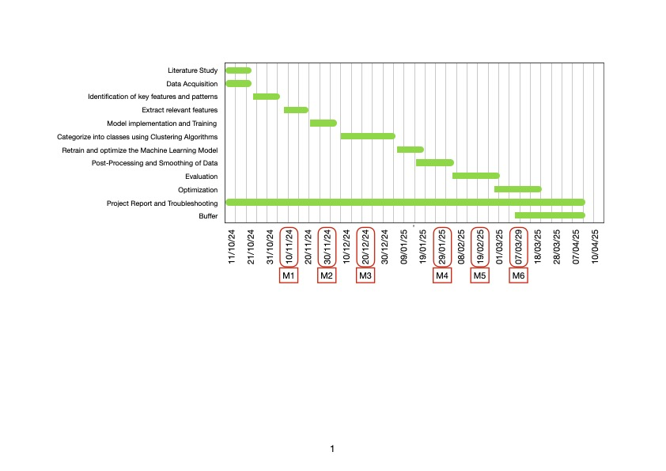

# RnD

Work in Progress...🚧

## Milestones
- ✅ **M1 Literature review completed and best practice identified**
- ✅ **M2 Data Collection and Pre-processing**
- ✅ **M3 Initial Model Implementation and Training**
- ✅ **M4 Model Evaluation and Optimization**
- ✅ **M5 Post Processing and Refinementb**
- 🟨 M6 Documentation

## Work Packages

- ✅ **WP1 Literature Study**
- ✅ **WP2 Identification of key features and patterns**
- ✅ **WP3 Extract relevant features**
- ✅ **WP4 Implement and train unsupervised machine learning model**
- ✅ **WP5 Categorize into classes using Clustering Algorithms**
- ✅ **WP6 Retrain and optimize the Machine Learning Model**
- ✅ **WP7 Post-Processing and Smoothing of the data**
- ✅ **WP8 Parameter tuning and optimize the model**
- 🟨 WP9 Evaluation
- 🟨 WP10 Documentation and troubleshooting
